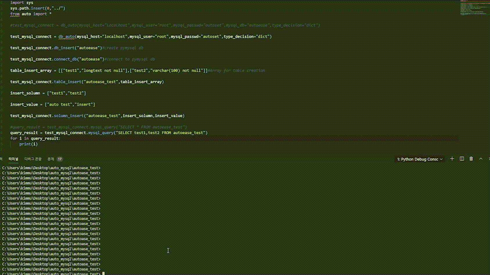

# autoease 1.1
pymysql 모듈을 이용해 조금 더 간략하고 조금더 쉽게 사용할수있게 만들어보았습니다.

# autoease 1 버전

db_auto(mysql_host,mysql_user,mysql_passwd,mysql_db= None,type_decision=None)
#mysql에 접속

mysql_query(sql_dict)
#sql 구문을 직접 실행

connect_db(db_name)
#원하는 db 접근

special_characters(table,not_column = [],special_check = None)
#원하는 테이블 안에있는 컬럼 데이터들을 기본 특수문자들로 검사

table_insert(table_name,column_name = [])
#table 생성

solumn_insert(table_name,solunm_name = [],solumn_value = [])
#컬럼 데이터 생성

column_update(table_name,column_return = [],if_column = [])
#컬럼 업데이트

column_delect(table_name,delete_data = [],data_if=None,asksend = None)
#컬럼 삭제

file_remove(file_location)
#원하는 파일 또는 디렉터리 삭제

# autoease 1.1버전

solumn_delete(self,table_name,solunm_name)
#컬럼 삭제

databases(self,type_double= None)
#db 조회

table_select(self,table_name,type_double = None)
#테이블 조회

solumn_select(self,select,table_name,type_double = None)
#컬럼 조회
